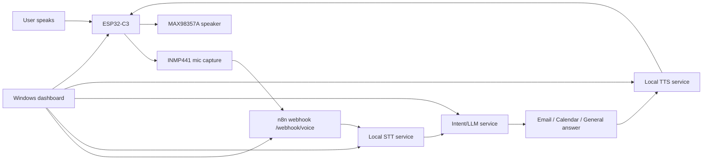

# AI Wrist Assistant

A local Windows-based AI voice assistant system using an ESP32-C3, INMP441 microphone, MAX98357A speaker output, n8n workflows, local speech services, and a polished web dashboard for monitoring and control.

The project is designed for a college demonstration where the assistant can listen for a wake word, send audio to a local workflow, understand commands, send emails, create calendar reminders, answer general questions, and return a spoken response through the speaker.

## Highlights

- ESP32-C3 voice client with wake-word checking.
- INMP441 I2S microphone input.
- MAX98357A I2S speaker output.
- n8n workflow integration through a local webhook.
- Deepgram/Whisper/ElevenLabs-capable speech-to-text service.
- Gemini/Pollinations-compatible intent and LLM service.
- gTTS WAV response service for speaker playback.
- Local dashboard with start, stop, restart, live logs, service cards, task history, and settings.
- GitHub-safe repository layout with secrets and generated runtime files excluded.

## System Architecture



## Repository Structure

```text
ai-wrist-assistant/
  ai-wrist-dashboard/
    backend/                 Express API, process manager, logs, tasks
    frontend/                React + Tailwind dashboard UI
    start-dashboard.ps1      Starts backend and frontend
    stop-dashboard.ps1       Stops dashboard processes

  esp32c3-n8n-voice-client/
    esp32c3-n8n-voice-client.ino
    voice_config.example.h   Copy to voice_config.h and fill local values

  local-whisper/
    server.py                STT gateway
    start-whisper.ps1
    requirements.txt

  local-gemini-intent/
    server.py                Intent and LLM gateway
    start-gemini-intent.ps1
    requirements.txt

  local-gtts/
    server.py                TTS WAV service
    start-gtts.ps1
    requirements.txt

  n8n-workflows/
    production-ready-workflow.json
                              Sanitized n8n workflow export

```

## Hardware Used

| Module | Purpose |
| --- | --- |
| ESP32-C3 | Main microcontroller and Wi-Fi client |
| INMP441 | I2S microphone input |
| MAX98357A | I2S speaker amplifier |
| Speaker | Audio response output |
| Windows laptop | Runs n8n, dashboard, STT, LLM, and TTS services |

## ESP32 Speaker Wiring

| MAX98357A | ESP32-C3 |
| --- | --- |
| VIN | 5V |
| GND | GND |
| BCLK | GPIO 8 |
| LRC | GPIO 9 |
| DIN | GPIO 10 |
| SD | Not connected |

## Prerequisites

Install these on Windows:

- Node.js 20 or newer
- Python 3.11
- Arduino CLI
- n8n
- Git
- A 2.4 GHz Wi-Fi network or hotspot

Useful checks:

```powershell
node --version
npm --version
python --version
arduino-cli version
n8n --version
```

## Secrets and Local Configuration

This repository intentionally does not include:

- API keys
- Wi-Fi passwords
- live `voice_config.h`
- dashboard runtime JSON files
- generated logs
- generated WAV/MP3 files
- Python virtual environments
- `node_modules`
- raw n8n workflow exports that may contain credentials

Use these template files:

```text
.env.example
ai-wrist-dashboard/backend/data/settings.example.json
esp32c3-n8n-voice-client/voice_config.example.h
```

Set provider keys as Windows user environment variables or in your local `.env` file:

```powershell
setx DEEPGRAM_API_KEY "your_deepgram_key"
setx GEMINI_API_KEY "your_gemini_key"
setx POLLINATIONS_API_KEY "your_pollinations_key"
setx TRANSCRIBE_PROVIDER "deepgram"
setx WHISPER_FALLBACK_ENABLED "false"
```

Restart PowerShell after using `setx`.

## Install Dashboard Dependencies

```powershell
cd "C:\n8n automation\ai-wrist-dashboard"
npm run install:all
```

For a cloned repo, replace the path with your local clone path:

```powershell
cd "C:\path\to\Ai_wrist_assistant\ai-wrist-dashboard"
npm run install:all
```

## Install Python Service Dependencies

Create virtual environments and install requirements for each local service:

```powershell
cd "C:\path\to\Ai_wrist_assistant\local-whisper"
py -3.11 -m venv .venv
.\.venv\Scripts\python.exe -m pip install -r requirements.txt

cd "C:\path\to\Ai_wrist_assistant\local-gemini-intent"
py -3.11 -m venv .venv
.\.venv\Scripts\python.exe -m pip install -r requirements.txt

cd "C:\path\to\Ai_wrist_assistant\local-gtts"
py -3.11 -m venv .venv
.\.venv\Scripts\python.exe -m pip install -r requirements.txt
```

## Configure ESP32 Firmware

Copy the example config:

```powershell
cd "C:\path\to\Ai_wrist_assistant\esp32c3-n8n-voice-client"
Copy-Item .\voice_config.example.h .\voice_config.h
```

Edit `voice_config.h`:

```cpp
static const char *WIFI_SSID = "YOUR_WIFI_SSID";
static const char *WIFI_PASSWORD = "YOUR_WIFI_PASSWORD";
static const char *N8N_HOST = "YOUR_PC_LAN_IP";
```

Find your PC LAN IP:

```powershell
ipconfig
```

Use the IPv4 address shown under your active Wi-Fi adapter. Do not use `localhost` or `127.0.0.1` in ESP32 firmware.

## Compile and Upload ESP32 Firmware

Example Arduino CLI commands:

```powershell
cd "C:\path\to\Ai_wrist_assistant\esp32c3-n8n-voice-client"

& "C:\Program Files\Arduino CLI\arduino-cli.exe" compile `
  --fqbn esp32:esp32:esp32c3 `
  "C:\path\to\Ai_wrist_assistant\esp32c3-n8n-voice-client"

& "C:\Program Files\Arduino CLI\arduino-cli.exe" upload `
  -p COM13 `
  --fqbn esp32:esp32:esp32c3 `
  "C:\path\to\Ai_wrist_assistant\esp32c3-n8n-voice-client"
```

Open serial monitor:

```powershell
& "C:\Program Files\Arduino CLI\arduino-cli.exe" monitor -p COM13 -c baudrate=115200,dtr=off,rts=off
```

## Run the Dashboard

```powershell
cd "C:\path\to\Ai_wrist_assistant\ai-wrist-dashboard"
npm run dev
```

Open:

```text
http://127.0.0.1:5173
```

Backend API:

```text
http://127.0.0.1:8787
```

Stop dashboard processes:

```powershell
npm run stop
```

## Dashboard Features

- Start All, Stop All, Restart All
- Service status cards
- Live ESP32 serial logs
- n8n logs
- Mic/STT logs
- Workflow/LLM logs
- Error logs
- Task history
- Last Successful AI Action
- Last Execution Status
- Settings page for COM port, baud rate, and commands

## Dashboard API Endpoints

```text
POST   /api/start
POST   /api/stop
POST   /api/restart
GET    /api/status
GET    /api/tasks
POST   /api/tasks
GET    /api/logs
DELETE /api/logs
GET    /api/settings
PUT    /api/settings
GET    /api/last-successful-ai-action
GET    /api/last-execution-status
```

Live logs use WebSocket:

```text
ws://127.0.0.1:8787/ws
```

## n8n Workflow Notes

This repository includes a sanitized workflow export:

```text
n8n-workflows/production-ready-workflow.json
```

Before committing, the export was cleaned so it does not include API keys, live n8n credential bindings, webhook instance IDs, or local runtime state. After importing it into n8n, reconnect Gmail and Google Calendar credentials, then replace `YOUR_GOOGLE_CALENDAR_ID` with your real calendar ID.

Expected local webhook:

```text
http://YOUR_PC_LAN_IP:5678/webhook/voice
```

For ESP32 access, n8n must be reachable from another device on the same network. On Windows, allow inbound TCP port `5678`:

```powershell
netsh advfirewall firewall add rule name="AI Wrist n8n webhook 5678" dir=in action=allow protocol=TCP localport=5678 profile=any
Set-NetConnectionProfile -InterfaceAlias "Wi-Fi" -NetworkCategory Private
```

Run PowerShell as Administrator for firewall commands.

## Wake Word Flow

1. ESP32 records a short wake-check audio sample.
2. Audio is sent to n8n.
3. n8n forwards audio to STT.
4. STT returns transcript and wake detection result.
5. If wake word is detected, ESP32 records the command.
6. n8n routes the command through the intent service.
7. The selected tool runs, for example email, calendar, or general answer.
8. TTS returns WAV audio.
9. ESP32 plays the reply through MAX98357A.

## Troubleshooting

### n8n shows Offline

Check health:

```powershell
Invoke-WebRequest http://127.0.0.1:5678/healthz -UseBasicParsing
Invoke-WebRequest http://YOUR_PC_LAN_IP:5678/healthz -UseBasicParsing
```

If local works but LAN IP fails, check firewall and Wi-Fi profile.

### ESP32 says Failed to connect to n8n

Check:

- ESP32 and laptop are on the same Wi-Fi.
- Wi-Fi is 2.4 GHz.
- `N8N_HOST` is the laptop IPv4 address.
- Windows firewall allows inbound TCP `5678`.
- Phone hotspot is not blocking device-to-device traffic.

Some mobile hotspots isolate connected devices. If that happens, use a normal router or a laptop-hosted hotspot.

### Wake word not detected

Check serial logs for:

```text
Wake audio level rms=...
Wake check skipped: too quiet
```

Speak closer to the INMP441 microphone or adjust:

```cpp
static const uint16_t WAKE_MIN_RMS = 110;
static const uint16_t WAKE_MIN_PEAK = 900;
```

### Speaker does not play audio

Check:

- MAX98357A VIN to 5V
- MAX98357A GND to GND
- BCLK to GPIO 8
- LRC to GPIO 9
- DIN to GPIO 10
- TTS service returns `audio/wav`

### Dashboard cannot stop services

The backend uses Windows `taskkill /T /F` to stop child processes. If a service is still alive, run PowerShell as Administrator and check the process using:

```powershell
netstat -ano | findstr ":5678"
tasklist | findstr node
```

## Recommended GitHub Practice

Keep this repository public-safe by avoiding:

- real `.env` files
- `voice_config.h`
- n8n exports with credentials
- logs
- generated audio files
- dashboard runtime JSON

Use examples and environment variables instead.

## License

Add your preferred license before public distribution.
